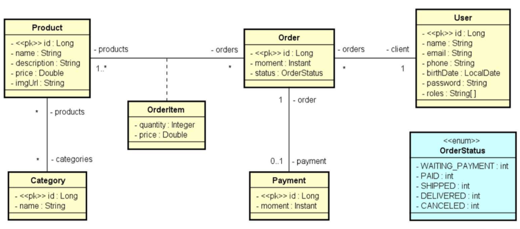

# DSCommerce-List

## Licença

Este projeto está licenciado sob a Licença MIT - veja o arquivo [LICENSE](./LICENSE) para mais detalhes.


Projeto de uma API RESTful para gerenciamento de produtos e pedidos em um sistema de e-commerce. Desenvolvido utilizando **Java 21** e **Spring Boot 3**, seguindo boas práticas de arquitetura, modelagem de domínio e segurança.

---

## Índice

- [Tecnologias Utilizadas](#tecnologias-utilizadas)
- [Modelagem de Domínio](#modelagem-de-domínio)
- [Operações CRUD](#operações-crud)
- [Autenticação e Autorização](#autenticação-e-autorização)
- [Consultas Personalizadas](#consultas-personalizadas)
- [Como Rodar o Projeto](#como-rodar-o-projeto)
- [Observações](#observações)

---

## Tecnologias Utilizadas

- Java 21
- Spring Boot 3
- Spring Data JPA
- Spring Security (JWT)
- Banco de Dados H2
- Maven

---

## Modelagem de Domínio


**Entidades Principais:**

- Product (Produto)
- Category (Categoria)
- User (Usuário)
- Order (Pedido)
- OrderItem (Item do Pedido)
- Payment (Pagamento)

**Enumerações:**

- OrderStatus (Status do Pedido)

# Relacionamentos entre Entidades

---
## 1. **Product ↔ Category** (@ManyToMany)
- **Descrição**: Um `Product` pode pertencer a várias `Category`, e uma `Category` pode ter vários `Products`. O relacionamento é feito através de uma tabela intermediária.
---
2. **Order ↔ User** (@ManyToOne)
- **Descrição**: Um `Order` pertence a um único `User`, mas um `User` pode ter vários `Orders`. Esse é um relacionamento de muitos para um.
---
3. **Order ↔ Payment** (@OneToOne)
- **Descrição**: Cada `Order` está relacionado a um único `Payment`, e cada `Payment` está vinculado a um único `Order`. Esse é um relacionamento um para um.
---
4. **Order ↔ Product** (Através de `OrderItem`)

- **Descrição**: O relacionamento entre `Order` e `Product` é intermediado pela entidade `OrderItem`, que armazena informações sobre a quantidade e o preço de cada produto em um pedido.
---




> 

##Classes:

#Product
```java
@Entity
@Table(name = "tb_product")
public class Product {
	
	@Id
    @GeneratedValue(strategy = GenerationType.IDENTITY)
	private Long id;
	private String name;
	
	@Column(columnDefinition = "TEXT")
	private String description;
	private Double price;
	private String imgUrl;
	
	@ManyToMany
	@JoinTable(name = "tb_product_category",
	        joinColumns = @JoinColumn(name = "product_id"),
	        inverseJoinColumns = @JoinColumn(name = "category_id"))
	private Set<Category> categories = new HashSet<>();
	
	@OneToMany(mappedBy = "id.product")
	public Set<OrderItem> items = new HashSet<>();
}
```

#Category
```java
@Entity
@Table(name = "tb_category")
public class Category {
	
	@Id
    @GeneratedValue(strategy = GenerationType.IDENTITY)
	private Long id;
	private String name;
	
	@ManyToMany(mappedBy = "categories")
	private Set<Product> product = new HashSet<>();
	
}


```

#Order
```java
@Entity
@Table(name = "tb_order")
public class Order {
	
	@Id
    @GeneratedValue(strategy = GenerationType.IDENTITY)
	private long id;
	
	@Column(columnDefinition = "TIMESTAMP WITHOUT TIME ZONE")
	private Instant moment;
	
	private OrderStatus status;
	
	@ManyToOne
	@JoinColumn(name = "client_id")
	private User client;
	
	@OneToOne(mappedBy = "order",cascade = CascadeType.ALL)
	private Payment payment;
	
	@OneToMany(mappedBy = "id.order")
	private Set<OrderItem> items = new HashSet<>();

}

```

#User
```java
@Entity
@Table(name = "tb_user")
public class User implements UserDetails {

	@Id
	@GeneratedValue(strategy = GenerationType.IDENTITY)
	private Long id;

	private String name;

	@Column(unique = true)
	private String email;
	private String phone;
	private LocalDate birthDate;
	private String password;

	@OneToMany(mappedBy = "client")
	private List<Order> orders = new ArrayList<>();

	@ManyToMany
	@JoinTable(name = "tb_user_role", joinColumns = @JoinColumn(name = "user_id"), inverseJoinColumns = @JoinColumn(name = "role_id"))
	private Set<Role> roles = new HashSet<>();

}

```

#Payment
```java
@Entity
@Table(name = "tb_payment")
public class Payment {
	
	@Id
    @GeneratedValue(strategy = GenerationType.IDENTITY)
	private Long id;
	
	@Column(columnDefinition = "TIMESTAMP WITHOUT TIME ZONE")
	private Instant moment;
	
	@OneToOne
	@MapsId
	private Order order;

}

```

#OrderItem
```java
@Entity
@ Table(name = "tb_orderItem")
public class OrderItem {
	
	@EmbeddedId
	private OrderItemPK id = new OrderItemPK();
	
	private Integer quantity;
	private Double price;
	
	public OrderItem() {
		
	}

	public OrderItem(Order order,Product product, Integer quantity, Double price) {
		id.setOrder(order);
		id.setProduct(product);
		this.quantity = quantity;
		this.price = price;
	}
}

```

#OrderItemPK
```java
@Embeddable
public class OrderItemPK {

	@ManyToOne
	@JoinColumn(name = "order_id")
	private Order order;
	
	@ManyToOne
	@JoinColumn(name = "product_id")
	private Product product;
	
}

```
---

## Operações CRUD

**Endpoints principais:**

- `/products`
- `/categories`
- `/orders`
- `/users`

## Exemplo: CRUD do Product(DTO, Service, Repository e Controller)
### **Estrutura do Projeto**
O projeto segue o padrão de camadas de responsabilidade:
- **DTO (Data Transfer Object)**: Responsável por transportar dados entre as camadas, sem expor diretamente as entidades do banco de dados. Ele serve como intermediário entre a camada de persistência e a camada de apresentação (API ou front-end), garantindo que apenas os dados necessários sejam enviados, evitando o acoplamento entre as camadas e melhorando a segurança e o desempenho e fácil de fazer a manutenção..
- **Service**: Contém a lógica de negócios.
- **Repository**: Faz a comunicação com o banco de dados.
- **Controller**: Expõe os endpoints da API e recebe as requisições.
---
## **Validação de Dados com Bean Validation**

No Spring Boot, a **Bean Validation** é usada para garantir que os dados recebidos em uma aplicação estejam de acordo com regras predefinidas antes de serem processados. Isso é especialmente útil para evitar que dados inválidos ou malformados cheguem à lógica de negócios e sejam persistidos no banco de dados. Para implementar isso no projeto, usamos a anotação `@Valid` nas rotas da API e as anotações de validação diretamente nos atributos do DTO, como visto no `ProductDTO`.

### **Validações no ProductDTO**

No `ProductDTO`, aplicamos diversas validações usando as anotações da Bean Validation, que ajudam a garantir que os dados estejam no formato esperado:

- `@NotBlank`: Garante que os campos **name** e **description** não estejam vazios ou apenas com espaços em branco.
- `@Size`: Restringe o número de caracteres em campos como **name** e **description** para garantir que eles possuam um tamanho adequado.
- `@NotNull`: Certifica que o **price** seja fornecido.
- `@Positive`: Verifica que o **price** seja um número positivo.
- `@NotEmpty`: Garante que a lista de **categories** não esteja vazia.

Essas anotações asseguram que apenas dados válidos sejam recebidos, melhorando a qualidade da aplicação e prevenindo erros.

### **Dependência de Validação**

Para usar a Bean Validation no Spring Boot, é necessário adicionar a dependência `spring-boot-starter-validation` no seu `pom.xml`, o que permite o uso das anotações de validação nas entidades e DTOs. Abaixo está a dependência que deve ser incluída no arquivo:

```xml
<dependency>
    <groupId>org.springframework.boot</groupId>
    <artifactId>spring-boot-starter-validation</artifactId>
</dependency>

###DTO
```java
public class ProductDTO {

	private Long id;
	@Size(min = 3, max = 80, message = " O campo tem que ter de 3 a 80 caracteres")
	@NotBlank(message = "Campo requerido")
	private String name;
	@Size(min = 10, message = " O campo tem que ter no mínimo 10 caracteres")
	@NotBlank(message = "Campo requerido")
	private String description;
	@NotNull(message = "Campo requerido")
	@Positive(message = "O preço tem que ser positivo")
	private Double price;
	private String imgUrl;

	@NotEmpty(message = "Tem que ter pelomenos uma categoria")
	private List<CategoryDTO> categories = new ArrayList<>();

	public ProductDTO() {

	}

	public ProductDTO(Long id, String name, String description, Double price, String imgUrl) {
		this.id = id;
		this.name = name;
		this.description = description;
		this.price = price;
		this.imgUrl = imgUrl;
	}

	public ProductDTO(Product entity) {
		id = entity.getId();
		name = entity.getName();
		description = entity.getDescription();
		price = entity.getPrice();
		imgUrl = entity.getImgUrl();
		for (Category cat : entity.getCategories()) {
			categories.add(new CategoryDTO(cat));
		}

	}
 getters e setters
---
public class ProductMinDTO {

	private Long id;
	private String name;
	private Double price;
	private String imgUrl;

	public ProductMinDTO() {

	}

	public ProductMinDTO(Long id, String name, Double price, String imgUrl) {
		this.id = id;
		this.name = name;
		this.price = price;
		this.imgUrl = imgUrl;
	}

	public ProductMinDTO(Product entity) {
		id = entity.getId();
		name = entity.getName();
		price = entity.getPrice();
		imgUrl = entity.getImgUrl();
	}
getters e setters
}
```
###Service
```java
@Service
public class ProductService {

	@Autowired
	private ProductRepository repository;

	@Transactional(readOnly = true)
	public ProductDTO findById(Long id) {
		Product product = repository.findById(id)
				.orElseThrow(() -> new ResourceNotFoundException("Recurso não encontrado"));
		return new ProductDTO(product);
	}

	@Transactional(readOnly = true)
	public Page<ProductMinDTO> findAll(String name, Pageable pageable) {
		Page<Product> result = repository.searchByName(name, pageable);
		return result.map(x -> new ProductMinDTO(x));
	}

	@Transactional
	public ProductDTO insert(ProductDTO dto) {
		Product entity = new Product();
		copyDtoToEntity(dto, entity);
		entity = repository.save(entity);
		return new ProductDTO(entity);
	}

	@Transactional
	public ProductDTO update(Long id, ProductDTO dto) {
		try {
			Product entity = repository.getReferenceById(id);
			copyDtoToEntity(dto, entity);
			entity = repository.save(entity);
			return new ProductDTO(entity);

		} catch (EntityNotFoundException e) {
			throw new ResourceNotFoundException("Recurso não encontrado!");
		}

	}

	@Transactional(propagation = Propagation.SUPPORTS)
	public void delete(Long id) {
		if (!repository.existsById(id)) {
			throw new ResourceNotFoundException("Recurso não encontrado");
		}
		try {
			repository.deleteById(id);
		} catch (DataIntegrityViolationException e) {
			throw new DataBaseException("Violação de restrição de integridade referencial!");
		}
	}

	private void copyDtoToEntity(ProductDTO dto, Product entity) {
		entity.setName(dto.getName());
		entity.setDescription(dto.getDescription());
		entity.setPrice(dto.getPrice());
		entity.setImgUrl(dto.getImgUrl());

		entity.getCategories().clear();
		for (CategoryDTO catDTO : dto.getCategories()) {
			Category cat = new Category();
			cat.setId(catDTO.getId());
			entity.getCategories().add(cat);
		}

	}
}
```
###Repository
```java
public interface ProductRepository extends JpaRepository<Product, Long> {

    @Query("SELECT obj FROM Product obj " +
    " WHERE UPPER(obj.name) LIKE UPPER(CONCAT('%',:name,'%')) ")
    Page<Product> searchByName(String name, Pageable pageable);

}
```
###Controller
```java
@RestController
@RequestMapping(value = "/products")
public class ProductController {

	@Autowired
	private ProductService service;

	@GetMapping(value = ("/{id}"))
	public ResponseEntity<ProductDTO> findById(@PathVariable Long id) {
		ProductDTO dto = service.findById(id);
		return ResponseEntity.ok(dto);
	}

	@GetMapping
	public ResponseEntity<Page<ProductMinDTO>> findAll(
			@RequestParam(name = "name", defaultValue = "") String name, Pageable pageable) {
		Page<ProductMinDTO> dto = service.findAll(name, pageable);
		return ResponseEntity.ok(dto);
	}

	@PreAuthorize("hasAnyRole('ROLE_ADMIN')")
	@PostMapping
	public ResponseEntity<ProductDTO> insert(@Valid @RequestBody ProductDTO dto) {
		dto = service.insert(dto);
		URI uri = ServletUriComponentsBuilder.fromCurrentRequest().path("/{id}").buildAndExpand(dto.getId()).toUri();
		return ResponseEntity.created(uri).body(dto);
	}

	@PreAuthorize("hasAnyRole('ROLE_ADMIN')")
	@PutMapping(value = ("/{id}"))
	public ResponseEntity<ProductDTO> update(@PathVariable Long id, @Valid @RequestBody ProductDTO dto) {
		dto = service.update(id, dto);
		return ResponseEntity.ok(dto);
	}

	@PreAuthorize("hasAnyRole('ROLE_ADMIN')")
	@DeleteMapping(value = ("/{id}"))
	public ResponseEntity<Void> delete(@PathVariable Long id) {
		service.delete(id);
		return ResponseEntity.noContent().build();
	}
}

```
